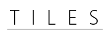

## What's this?
Tiles is a CSS3 animation library that makes it really easy to attach animation to document object models.
## Usage
To use this library simply put the following snippet within the `<head>` tag of your html document:
```html
<link href="https://rawgithub.com/victoralveflo/tiles/master/tiles.css" 
  rel="stylesheet" 
  media="screen">
```
## API
#### "Document load" functionality
`.bounceIn` - Performs a bouncing effect on the parent element
#### Hover functionality
##### Scaling
With `.scale<VALUE>` you increase/decrease the size of the parent element. The value is given in percent: scale10 -> Scale parent to 10% of original size. 

Available classes:

`.scale10`
`.scale20`
`.scale30`
`.scale40`
`.scale50`
`.scale60`
`.scale70`
`.scale80`
`.scale90`
`.scale110`
`.scale120`
`.scale130`
`.scale140`
`.scale150`
`.scale160`
`.scale170`
`.scale180`
`.scale190`
##### Rotating
With `.rotate<ANGLE>` you rotate the parent element by the given angle. The angle is given in degrees: rotate90 -> Rotates parent by 90 degrees.

Avalable classes:


`.rotate10`
`.rotate20`
`.rotate30`
`.rotate40`
`.rotate50`
`.rotate60`
`.rotate70`
`.rotate80`
`.rotate90`
`.rotate100`
`.rotate110`
`.rotate120`
`.rotate130`
`.rotate140`
`.rotate150`
`.rotate160`
`.rotate170`
`.rotate180`
 
`.rotate-10`
`.rotate-20`
`.rotate-30`
`.rotate-40`
`.rotate-50`
`.rotate-60`
`.rotate-70`
`.rotate-80`
`.rotate-90`
`.rotate-100`
`.rotate-110`
`.rotate-120`
`.rotate-130`
`.rotate-140`
`.rotate-150`
`.rotate-160`
`.rotate-170`
`.rotate-180`

###### Fading
With `.fade<VALUE>` you fade the parent element with the given value. The value is given in percent: fade90 -> Fades parent to 10% visibility

Note that the value is inverted corresponding to the opacity parameter!

Available classes:


`.fade90`
`.fade80`
`.fade70`
`.fade60`
`.fade50`
`.fade40`
`.fade30`
`.fade20`
`.fade10`

###### Highlighting

`.highlight` - Inverts all colors in the parent element
#### Other
`.tile` - A basic tile element

## Example
Check out the example live [here](http://jambler.se/demos/tiles/)!
```html
<!DOCTYPE html>
<html>
	<head>
		<link href="https://rawgithub.com/victoralveflo/tiles/master/tiles.css" 
			rel="stylesheet" 
	  		media="screen">
	  	<style>
	  		body {
			  background-color: #fff;
			}

			#container {
				height: auto;
				width: 315px;
				margin-left:auto;
				margin-right: auto;
				margin-top: 100px;
			}

	  	</style>
	</head>
	<body>
		<div id="container">
			<center>
		  	  <br>
			  <button class="tile scale-dec">			scale decrease</button>
			  <button class="tile scale-inc">			scale increase</button>
			  <button class="tile rotate">				rotate</button>
			  <button class="tile fade">				fade</button>
			  <button class="tile bounceIn scale-dec">	bounce in + scale</button>
			  <button class="tile highlight">			highlight</button>
			</center>
		</div>
	</body>
</html>
```
